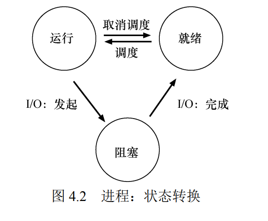

# 进程抽象

简单来说：进程就是运行中的程序。

时分共享CPU（time sharing）技术：操作系统通过虚拟化CPU来实现有许多CPU的假象，通过让一个进程只运行一个时间片，然后切换到其他进程，操作系统提供了存在许多CPU的假象。

要实现CPU的虚拟化，操作系统需要实现：

1. 调度策略：如何确定下一个时间片该运行哪个进程
2. 切换机制：保存进程上下文以确保其能恢复运行

## 抽象：进程

操作系统为正在运行的程序提供的抽象，正是所谓的进程。

粗略的描述如下：

1. Loading：操作系统运行程序的第一件事就是将代码和所有静态数据加载到内存中。早期操作系统中加载过程尽早完成，而现代操作系统惰性执行该过程，即只在程序执行期间加载需要的代码。
2. Initial：然后操作系统将会为程序的运行时栈（run-time stack）分配内存，并初始化运行时栈，即填入main函数的参数。
3. 其他的初始化任务。例如在Unix中，默认每个进程会有3个打开的文件描述符，分别是标准输入、输出和错误。
4. Jumping：跳转到main函数，程序开始执行。

## 进程状态

进程会有以下三种状态:

- running
- ready
- blocked

