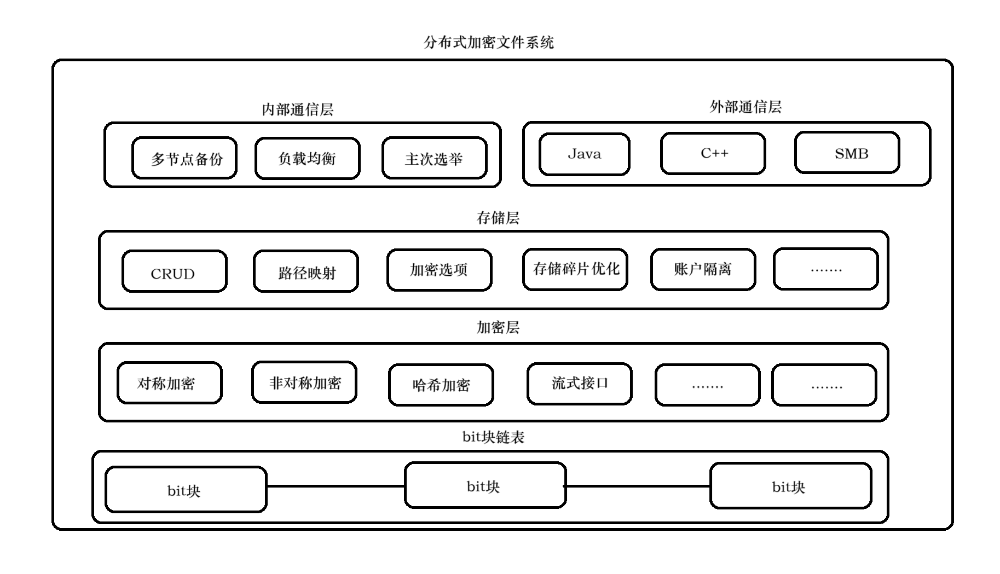

# 分布式加密文件系统基础服务

## 概念设计

### 1. 主要目标

1. 设计分布式，支持集群部署，实现高可用（服务部分宕机仍然可用）
2. 多语言易用SDK（Java、C++、Python、Go）
3. 使用非对称加密、对称加密相结合对文件进行加密
4. 底层使用C/C++或Go进行开发，支持多平台编译
5. 使用TCP协议进行底层和应用层的通信
6. 自定义加密文件存储结构（以bit块链表为基础）
7. 多平台易用GUI（Windows、MacOS、Linux、Android）

### 2. 大致设计

1. 底层主要关心文件加密以及文件存储
2. SDK层主要封装与底层的通信，提供易用接口
3. 应用层提供相关服务
4. GUI层与应用层进行通信，面向具体用户

### 3. 底层设计

1. 使用bit块链表作为基础数据结构
2. 存储层实现bit块链表的存储管理
3. 加密层实现明文数据到加密数据的转换
4. 内部通信层实现多个服务节点之间的通信（实现多节点备份、主次选举、负载均衡）
5. 外部通信层实现客户端连接（实现Java、C++等语言SDK与服务端进行通信）

### 4. 概念设计图

